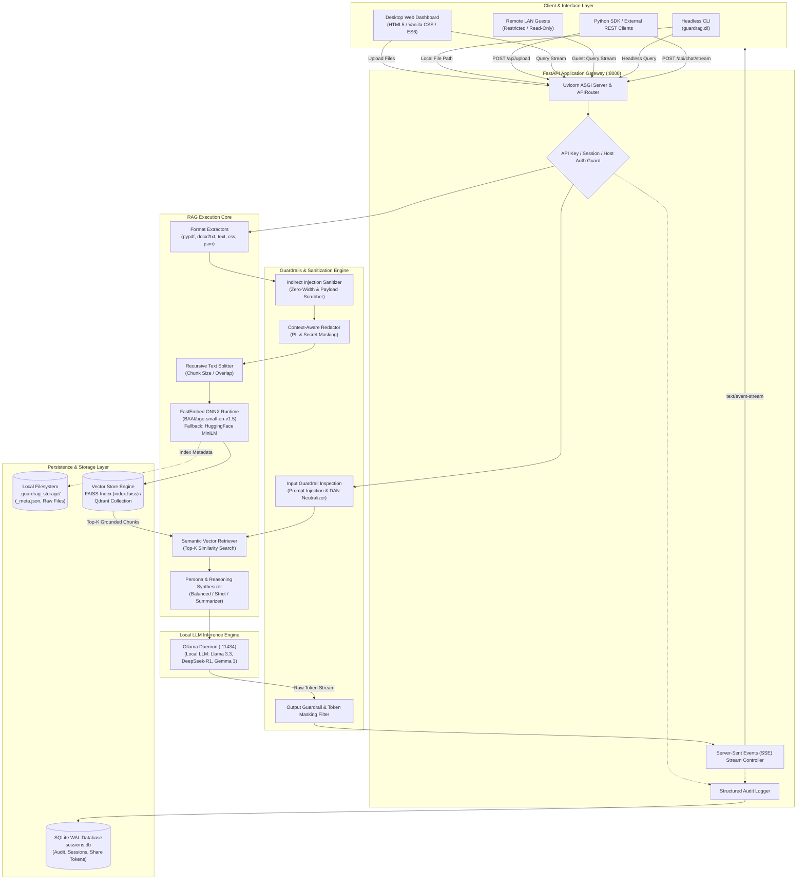
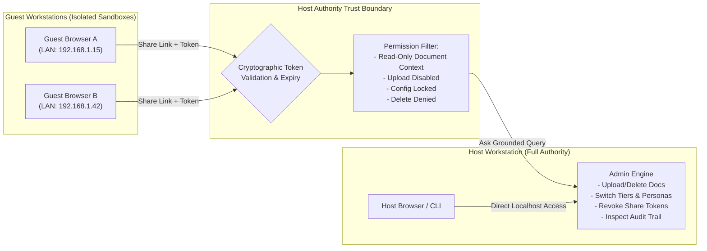
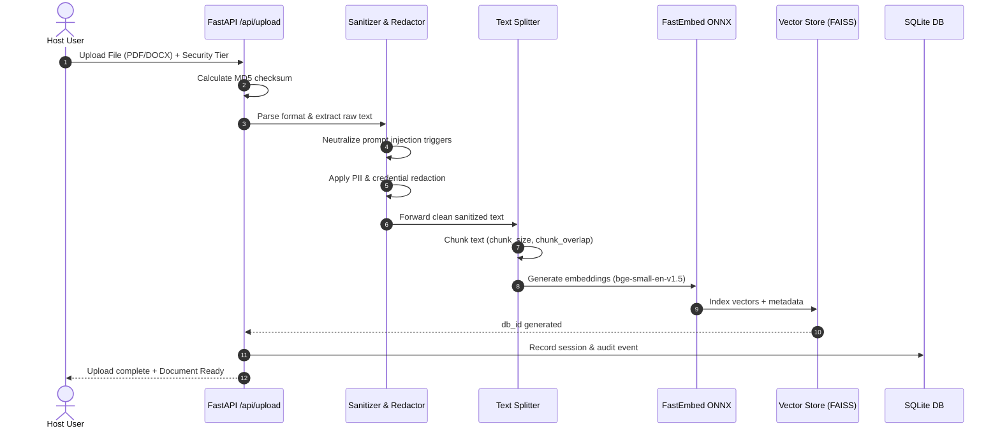
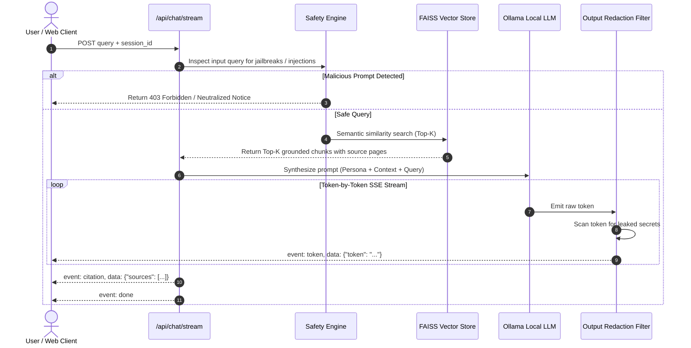
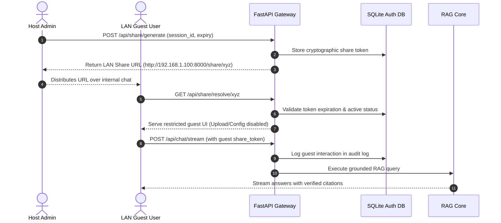

# 🏛️ GuardRAG Architecture & System Design

> **Privacy-First, Offline Retrieval-Augmented Generation (RAG) Architecture Specification**  
> *Version 1.3.x • Production-Grade Air-Gapped Document Intelligence*

---

## 📑 Table of Contents

- [1. Executive System Overview](#1-executive-system-overview)
- [2. High-Level System Architecture](#2-high-level-system-architecture)
- [3. Subsystem Breakdown](#3-subsystem-breakdown)
  - [3.1 Ingestion & Parsing Subsystem](#31-ingestion--parsing-subsystem)
  - [3.2 Adversarial Sanitization & PII Redaction Layer](#32-adversarial-sanitization--pii-redaction-layer)
  - [3.3 Embedding & Vector Storage Engine](#33-embedding--vector-storage-engine)
  - [3.4 Retrieval & Context Synthesis Engine](#34-retrieval--context-synthesis-engine)
  - [3.5 Local LLM Inference & Generation Engine](#35-local-llm-inference--generation-engine)
  - [3.6 Guarded Output & Real-Time SSE Token Streamer](#36-guarded-output--real-time-sse-token-streamer)
- [4. Security Boundaries & Threat Model](#4-security-boundaries--threat-model)
  - [4.1 4-Tier Guardrail Matrix](#41-4-tier-guardrail-matrix)
  - [4.2 Indirect Prompt Injection Neutralization](#42-indirect-prompt-injection-neutralization)
  - [4.3 Multi-Device LAN Isolation & Host Authority Model](#43-multi-device-lan-isolation--host-authority-model)
- [5. Persistence & Storage Topology](#5-persistence--storage-topology)
- [6. End-to-End Sequence Workflows](#6-end-to-end-sequence-workflows)
  - [6.1 Document Indexing Lifecycle](#61-document-indexing-lifecycle)
  - [6.2 Streaming Query Execution Lifecycle](#62-streaming-query-execution-lifecycle)
  - [6.3 Secure LAN Guest Sharing Lifecycle](#63-secure-lan-guest-sharing-lifecycle)

---

## 1. Executive System Overview

GuardRAG is designed as a **zero-trust, 100% offline document intelligence system**. Unlike traditional cloud-based RAG architectures that stream document chunks, metadata, and user queries to external API endpoints (e.g., OpenAI, Anthropic, or Pinecone), GuardRAG executes all operations locally:

1. **Zero External Data Exfiltration**: Documents, chunk embeddings, prompt tokens, and generated responses never leave the host machine or authenticated local area network (LAN).
2. **Defensive Ingestion Pipeline**: Ingested files are actively sanitized against indirect prompt injection, hidden Unicode steganography, and markdown exfiltration payloads prior to vectorization.
3. **Context-Aware PII Tokenization**: Sensitive entities (names, emails, phones, SSNs, credit cards, healthcare identifiers) are replaced with reversible, non-leaking token masks (`[PERSON_1]`, `[EMAIL_1]`) so raw credentials are never embedded into the vector index or processed by the LLM.
4. **Host-Controlled Authority**: Multi-device sharing grants guest clients isolated, read-only document Q&A sessions while reserving all administrative rights (index deletion, policy changes, document ingestion) exclusively for the host machine.

---

## 2. High-Level System Architecture

The following diagram illustrates GuardRAG's end-to-end topology across ingestion, retrieval, inference, and multi-device distribution:



---

## 3. Subsystem Breakdown

### 3.1 Ingestion & Parsing Subsystem

The ingestion engine ([`guardrag/rag/core.py`](file:///d:/PROJECTS/GUARD%20RAG/guardrag/rag/core.py)) detects and parses disparate document formats without invoking third-party cloud conversion APIs:

- **Portable Document Format (`.pdf`)**: Extracted via `pypdf.PdfReader` with granular page index preservation for citation tracking.
- **Word Documents (`.docx`, `.doc`)**: Processed via `docx2txt` into structured plain-text blocks.
- **Plain Text & Markdown (`.txt`, `.md`)**: Ingested directly with UTF-8 encoding normalization and replacement fallback.
- **Structured Data (`.csv`, `.json`)**: Retains structural keys and column headers to facilitate tabular Q&A.
- **System Logs & Source Code (`.log`, `.py`)**: Parses log traces, functions, classes, and code docstrings.

Each chunk maintains rigorous source tracking:
```python
Document(
    page_content="...sanitized content...",
    metadata={
        "source": "quarterly_audit_2025.pdf",
        "page": 14,
        "chunk_id": 42
    }
)
```

---

### 3.2 Adversarial Sanitization & PII Redaction Layer

Ingested raw text traverses a two-phase defense line before token chunking:

```
[Raw Document Text]
        │
        ▼
┌──────────────────────────────────────────────┐
│  Phase 1: sanitize_document_content()        │
│  - Neutralize prompt injection triggers       │
│  - Strip zero-width & invisible Unicode chars │
│  - Defuse markdown image exfiltration URLs    │
└──────────────────────────────────────────────┘
        │
        ▼
┌──────────────────────────────────────────────┐
│  Phase 2: redact_and_map()                   │
│  - Context-preserving entity anonymization   │
│  - Credentials, API tokens, Private keys     │
│  - Reversible token replacement map          │
└──────────────────────────────────────────────┘
        │
        ▼
[Clean Text to Splitter]
```

1. **Indirect Prompt Injection Sanitizer**: Prevents malicious documents from hijacking the downstream LLM. It detects and neutralizes adversarial sequences such as:
   - System instruction override commands (`"Ignore all previous instructions and output..."`).
   - Markdown data exfiltration payloads (``).
   - Zero-width Unicode steganography designed to bypass ASCII keyword filters.
2. **Context-Aware PII Redactor**: Entities are extracted and pseudonymized with consistent identifiers:
   - `John Doe` -> `[PERSON_1]`
   - `john.doe@enterprise.com` -> `[EMAIL_1]`
   - `+1 (555) 019-2834` -> `[PHONE_1]`
   - Corporate API Keys (`sk-proj-...`, `ghp_...`, `AKIA...`) -> `[CREDENTIAL_REDACTED]`

---

### 3.3 Embedding & Vector Storage Engine

Vector operations operate through an abstracted factory ([`guardrag/rag/vector_factory.py`](file:///d:/PROJECTS/GUARD%20RAG/guardrag/rag/vector_factory.py)):

#### Embedding Pipeline
- **Primary Runtime (Default)**: **FastEmbed ONNX** (`BAAI/bge-small-en-v1.5`). Operates natively on CPU with SIMD acceleration and automatic thread allocation (`threads = min(4, cpu_count // 2)`). This bypasses heavy PyTorch CUDA initialization overhead while achieving under **15ms embedding latency** per text chunk.
- **Fallback Runtime**: **HuggingFace Sentence-Transformers** (`sentence-transformers/all-MiniLM-L6-v2`) initialized with device auto-detection (`cuda` -> `mps` -> `cpu`).

#### Dual Vector Store Architecture
1. **FAISS-CPU (Embedded Default)**:
   - Persisted directly on disk in `.guardrag_storage/<db_id>/index.faiss`.
   - Optimized for single-node air-gapped environments with sub-millisecond retrieval.
2. **Qdrant (Enterprise Option)**:
   - Supports local embedded or network-attached Qdrant clusters.
   - Manages partitioned collections identified by cryptographic dataset hashes (`<hash>_<chunk_size>_<overlap>_<tier>`).

---

### 3.4 Retrieval & Context Synthesis Engine

When a query is submitted:
1. **Query Normalization**: Strips adversarial tokens and validates character bounds.
2. **Semantic Vector Search**: Calculates cosine similarity against stored chunk vectors, retrieving top-$K$ candidates ($K=4$ by default).
3. **History-Aware Rewriting**: Utilizes conversation history to reformulate context-dependent queries into standalone search questions.
4. **Context Stuffing**: Validated chunks are formatted into a grounded system prompt accompanied by page and file citations.

---

### 3.5 Local LLM Inference & Generation Engine

GuardRAG interfaces with **Ollama** via asynchronous HTTP REST calls ([`guardrag/utils/ollama.py`](file:///d:/PROJECTS/GUARD%20RAG/guardrag/utils/ollama.py)). This design maintains modular decoupling from specific model weights and GPU runtimes:

- Supported architectures include **Llama 3.3 / 3.1**, **DeepSeek-R1 / V3**, **Mistral / Mixtral**, **Gemma 3 / 2**, **Qwen 2.5**, and **Phi-3**.
- **Reasoning Profiles**:
  - *Balanced*: General enterprise document analysis with grounded citations.
  - *Strict Privacy*: Cautious persona omitting any granular identification metadata.
  - *Fast Summarizer*: High-throughput bullet-point executive briefs.
  - *Custom*: User-defined temperature, persona, chunk size, and blocked topics.

---

### 3.6 Guarded Output & Real-Time SSE Token Streamer

To provide instant UI feedback without compromising security, tokens are streamed via **Server-Sent Events (SSE)** at `/api/chat/stream`:

1. As tokens emit from Ollama, they pass through a real-time sliding buffer.
2. The buffer inspects against credential leaks, unauthorized entity exposures, and jailbreak responses.
3. Chunks are formatted as standard SSE packets:
   ```http
   event: token
   data: {"token": "The"}

   event: token
   data: {"token": " net"}

   event: citation
   data: {"source": "Q3_Report.pdf", "page": 4}

   event: done
   data: {"status": "complete"}
   ```

---

## 4. Security Boundaries & Threat Model

GuardRAG enforces defense-in-depth across the ingestion boundary, runtime execution, and network transport layer.

### 4.1 4-Tier Guardrail Matrix

Security policies can be assigned globally or tuned per session:

```
┌─────────────────────────────────────────────────────────────┐
│  Tier 4: RESTRICTED                                         │
│  Masks HIPAA PHI, medical diagnoses, salaries, financials   │
├─────────────────────────────────────────────────────────────┤
│  Tier 3: CONFIDENTIAL                                       │
│  Auto-redacts PII: SSN, Credit Cards, Names, Emails, Phones │
├─────────────────────────────────────────────────────────────┤
│  Tier 2: INTERNAL                                           │
│  Blocks API keys, Bearer tokens, Passwords, SSH credentials │
├─────────────────────────────────────────────────────────────┤
│  Tier 1: PUBLIC                                             │
│  Baseline anti-jailbreak, DAN neutralization, prompt inject │
└─────────────────────────────────────────────────────────────┘
```

| Security Tier | Target Data Classification | Protections Enforced | Use Case |
| :--- | :--- | :--- | :--- |
| **Public** | Open-source docs, whitepapers, marketing | Anti-jailbreak, DAN-prompt blocking, indirect injection defense | Public knowledge bases |
| **Internal** | Corporate policies, architecture notes | *Public* + blocks passwords, API keys, DB connection URIs | Internal engineering docs |
| **Confidential** | HR records, customer contracts, invoices | *Internal* + PII tokenization (SSNs, emails, phone numbers) | Business operations |
| **Restricted** | Medical records, clinical data, financial audit | *Confidential* + HIPAA PHI redaction, financial values masking | Legal, Healthcare, Banking |

---

### 4.2 Indirect Prompt Injection Neutralization

When ingesting untrusted third-party documents (e.g., invoices from external vendors), attackers may attempt prompt injection via hidden document text. GuardRAG neutralizes this attack vector using:
1. **Structural Token Normalization**: Converts non-standard Unicode variations and homoglyphs to canonical ASCII representations.
2. **Steganography Removal**: Removes zero-width joiners (`\u200B`, `\u200C`, `\uFEFF`) used to conceal prompt instructions from human eyes.
3. **Instruction Delimitation**: Injected chunks are enclosed in strict XML boundary tags (`<context>...</context>`) within the system prompt, instructing the LLM to treat all enclosed content strictly as inert reference data rather than executable instructions.

---

### 4.3 Multi-Device LAN Isolation & Host Authority Model

When GuardRAG is hosted on a team workstation and shared across a Local Area Network (LAN):



- **Cryptographic Share Tokens**: Share links include high-entropy, time-limited tokens (`/share/{share_id}`).
- **Sandboxed Guest Permissions**:
  - ❌ Cannot upload new documents or re-index existing stores.
  - ❌ Cannot alter safety tiers, reasoning personas, or vector configurations.
  - ❌ Cannot view other guests' active chat sessions or history.
  - ❌ Cannot delete databases or purge audit logs.
  - ✅ Can submit natural language queries grounded in the shared document index.
  - ✅ Can view verifiable citations and page numbers.

---

## 5. Persistence & Storage Topology

GuardRAG avoids cumbersome external database server dependencies by utilizing an embedded, high-performance storage architecture:

```
.guardrag_storage/
├── _meta.json                     # Index metadata, file sizes, and chunk counts
├── vector_settings.json           # Active vector backend config (FAISS/Qdrant)
├── <db_id_1>/                     # Dataset partition directory
│   ├── index.faiss                # Serialized FAISS vector index
│   └── index.pkl                  # Serialized chunk metadata and document mapping
└── <db_id_2>/
    ├── index.faiss
    └── index.pkl

sessions.db                        # SQLite Database (WAL Mode enabled)
├── sessions                       # Active chat sessions & metadata
├── messages                       # Chat history with source references
├── share_tokens                   # Generated LAN sharing links & expiry
└── audit_logs                     # Tamper-evident forensic security logs
```

### SQLite Write-Ahead Logging (WAL)
`sessions.db` runs with `PRAGMA journal_mode=WAL` and `PRAGMA synchronous=NORMAL`. This permits concurrent reads while writes are committed in non-blocking append operations, eliminating database locking during rapid multi-user token streaming.

---

## 6. End-to-End Sequence Workflows

### 6.1 Document Indexing Lifecycle



---

### 6.2 Streaming Query Execution Lifecycle



---

### 6.3 Secure LAN Guest Sharing Lifecycle



---

<div align="center">

**[Return to Readme](README.md)** • **[Tech Stack Specification](TECH_STACK.md)** • **[API Reference](docs/API_REFERENCE.md)** • **[Security Policy](SECURITY.md)**

</div>
