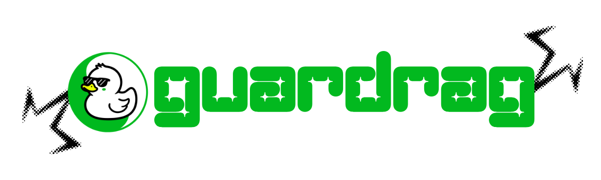
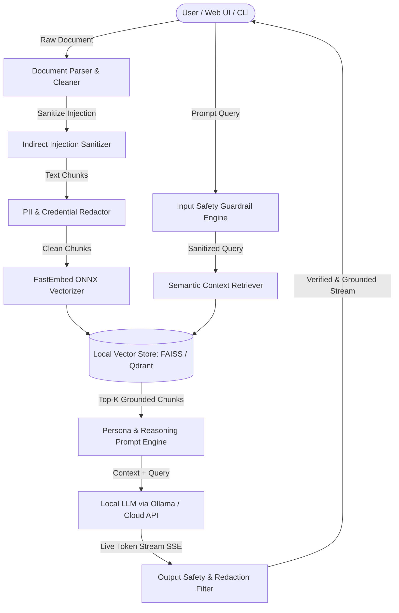

<div align="center">



# 🛡️ GuardRAG Enterprise

### Privacy-First, 100% Offline AI Document Intelligence & Retrieval

**Powered by Local LLMs, 4-Tier Safety Guardrails, Real-Time Token Streaming & Host-Controlled Multi-Device Sharing**

[](https://pypi.org/project/guard-rag/)
[](https://www.python.org/)
[](https://ollama.ai)
[](https://github.com/facebookresearch/faiss)
[](./tests)
[](./LICENSE)

<br/>

> **Interact with sensitive enterprise documents with complete privacy and zero data leakage.**  
> GuardRAG runs 100% locally on your hardware. No prompts, documents, or embeddings ever leave your device or internal network.  
> Every AI answer is strictly grounded in verifiable source citations and protected by multi-tier PII scrubbing, credential blocking, anti-jailbreak defenses, and customizable reasoning personas.

---

**[Features](#-key-features--updates) • [Installation](#-installation) • [Quick Start](#-quick-start) • [API Reference](#-python-sdk-integration) • [Contributing](#-contributing--license)**

</div>

---

## 📋 Table of Contents

- [Overview](#overview)
- [Key Features](#-key-features--updates)
- [Architecture](#-architecture--security-pipeline)
- [Security Tiers](#-4-tier-safety-guardrails)
- [Installation](#-installation)
- [Quick Start](#-quick-start)
- [Python SDK](#-python-sdk-integration)
- [CLI Usage](#-command-line-interface-cli)
- [Supported Formats](#-supported-document-formats)
- [Testing](#-testing--validation)
- [Troubleshooting](#-troubleshooting)
- [Contributing](#-contributing--license)

---

## 📖 Overview

GuardRAG is a privacy-centric Retrieval-Augmented Generation (RAG) chatbot that operates completely offline as a Python package. It's engineered for organizations handling sensitive data in **Legal, Healthcare, Finance, and Enterprise IT** sectors where compliance and zero external telemetry are non-negotiable.

### Why GuardRAG?

- ✅ **100% Offline** — No cloud dependencies, no data leakage
- ✅ **Enterprise-Grade Security** — 4-tier configurable safety guardrails with PII redaction and credential masking
- ✅ **Zero Setup Overhead** — Single pip install, runs on CPU or GPU
- ✅ **Multi-Device Ready** — Share securely over LAN with granular host-controlled permissions
- ✅ **Source-Grounded Answers** — Every response cites verifiable document sources with page numbers

---

## 🌟 Key Features & Updates

GuardRAG combines cutting-edge privacy technology with enterprise-ready infrastructure:

| **Capability** | **Description** |
| :--- | :--- |
| 🛡️ **100% Offline Inference** | Operates entirely on local CPU/GPU using Ollama models (Gemma, LLaMA, DeepSeek, Mistral, Qwen, Phi) and FastEmbed ONNX embeddings. No internet required. |
| ⚡ **Real-Time Token Streaming** | Instant typewriter-style responses rendered with Server-Sent Events (SSE) via `/api/chat/stream` for zero perceived latency. |
| 🔒 **4-Tier Safety Guardrails** | Configurable security tiers (*Public*, *Internal*, *Confidential*, *Restricted*) providing real-time credential blocking, PII redaction, prompt injection defense, and compliance filtering. |
| 🛡️ **Indirect Injection Defense** | Sanitizes ingested documents against prompt injection attacks, zero-width steganography, markdown exfiltration payloads, and embedded malicious instructions. |
| 📜 **Persistent Audit Logging** | SQLite WAL-backed structured audit trails with indexed timestamps, event categories, forensic metadata, and compliance-ready export formats. |
| 🔐 **Enterprise API Key Auth** | Protect administrative and document upload endpoints using optional `GUARDRAG_API_KEY` header verification and role-based access control. |
| 🐳 **Docker & Compose Ready** | Multi-stage non-root container, persistent `/data` volume, network isolation, and one-command orchestration with optional Ollama bundling. |
| 📈 **Telemetry & Metrics** | Real-time `/api/metrics` endpoint reporting query throughput, average latency, uptime, vector store sizes, and performance KPIs. |
| 🎭 **Reasoning & Custom Profiles** | Switch between *Balanced*, *Strict Privacy*, and *Fast Summarizer* reasoning presets, or create persistent custom profiles with tailored personas and guardrail tuning. |
| 🌐 **Host-Controlled LAN Sharing** | Share document Q&A securely across your local network. Host machines retain exclusive admin authority—guests cannot alter security levels, upload documents, or delete indexes. |
| 📁 **Broad Document Support** | Ingest and search `.pdf`, `.docx`, `.doc`, `.txt`, `.md`, `.csv`, `.json`, `.log`, and `.py` files with automatic format detection and multi-language support. |
| 🔌 **Python SDK & Headless CLI** | Full programmatic access via clean Python APIs and headless command-line interface for CI/CD pipelines, automated document workflows, and batch processing. |

---

## 🏗️ Architecture & Security Pipeline

GuardRAG guarantees complete data isolation across ingestion, retrieval, and LLM generation phases. All processing happens locally on your hardware.



---

## 🛡️ 4-Tier Safety Guardrails

Configure your security baseline per-session or when generating shared LAN links. Each tier is cumulative—higher tiers inherit all protections from lower tiers.

| Tier | Level | Protections & Masking |
| :---: | :---: | :--- |
| 🟢 | **Public** (Low) | Baseline anti-jailbreak, prompt injection defense, DAN-mode neutralization. No data masking. |
| 🔵 | **Internal** (Medium) | *Public* tier + Blocks exposure of API keys, bearer tokens, passwords, database URIs, SSH keys, and corporate credentials. |
| 🟡 | **Confidential** (High) | *Internal* tier + Automatically redacts Personally Identifiable Information: SSNs, credit card numbers, email addresses, phone numbers, person names, geographic locations. |
| 🔴 | **Restricted** (Strict) | *Confidential* tier + Certified strict regulatory lock: masks medical records, diagnoses, HIPAA-protected health information, salaries, financial transactions, and government IDs. |

**Use Cases:**
- `Public`: General-purpose document Q&A, knowledge bases
- `Internal`: Internal memos, corporate policies, non-sensitive business docs
- `Confidential`: Customer data, financial reports, employee records
- `Restricted`: Healthcare records, legal contracts, financial PII, regulatory compliance

---

## 🎭 Reasoning Profiles & Custom Personas

Tailor how GuardRAG processes and responds to document queries. Profiles control tone, depth, and safety posture:

1. **Balanced (Default)**
   - General-purpose reasoning delivering helpful, concise, grounded answers.
   - Best for mixed document types and diverse user audiences.
   - Moderate verbosity, includes source citations.

2. **Strict Privacy**
   - Extra-cautious persona with aggressive redaction of sensitive contextual references.
   - Omits specific names, numbers, and identifying details.
   - Ideal for multi-user environments and sensitive data.

3. **Fast Summarizer**
   - Direct, high-level executive bullet summaries for rapid document review.
   - Minimal verbosity, focus on key takeaways.
   - Perfect for rapid triage and decision support.

4. **Custom Profile Builder**
   - Define custom system persona instructions and tone.
   - Configure chunk sizes (500–4000 chars) and overlap ratios.
   - Specify custom blocked keywords and topics.
   - Enable/disable source citations.
   - Settings persist automatically across sessions in the persistent storage directory.

**Example Custom Profile:**
```json
{
  "name": "Legal Review",
  "persona": "You are a legal document analyst. Focus on identifying key obligations, liabilities, and party definitions.",
  "chunk_size": 2000,
  "chunk_overlap": 400,
  "blocked_keywords": ["trade secrets", "confidential formulae"],
  "include_citations": true,
  "guardrail_tier": "Restricted"
}
```

---

## 🌐 Secure Multi-Device LAN Sharing

Host GuardRAG on your workstation or local server and collaborate securely across your team **without exposing data to the public internet**.

### Host Features
- **Host Authority Mode**: Only the host machine can alter security policies, switch reasoning profiles, or ingest/delete document indexes.
- **Admin Dashboard**: Manage user permissions, view audit logs, and configure global security policies.
- **Granular Share Links**: Generate time-limited or permanent share URLs with specific document access.

### Guest Experience
- **Isolated Interface**: Guests access a streamlined, read-only interface with contextual suggested queries.
- **Contextual Suggestions**: Auto-generated query examples based on the active document.
- **Zero Upload Capability**: Guests cannot upload, delete, or modify any documents or indexes.
- **Automatic Logout**: Sessions expire after configurable inactivity period.

### Network Configuration
- **Local Network Broadcast**: Automatically detects and displays local IP access URLs (`http://192.168.x.x:8000`).
- **Frictionless LAN Connectivity**: No VPN or reverse proxy required; connect directly within your network.
- **Optional Remote Tunnel**: Support for secure reverse proxy (ngrok, Cloudflare Tunnel) for remote team access.
- **Custom Port Mapping**: Configure custom ports and domain aliases.

---

## 📥 Installation

### Option 1: Install via PyPI (Recommended)

```bash
pip install guard-rag
```

Verify installation:
```bash
guard-rag --version
```

### Option 2: Install from Source

Clone the repository and install in development mode:

```bash
git clone https://github.com/sowmiyan-s/GUARD-RAG.git
cd GUARD-RAG
pip install -e ".[dev]"
```

### Prerequisites

- **Python 3.9 or later**
  - Check version: `python --version`
  - Install: [python.org](https://www.python.org/downloads/)

- **Ollama** (for local LLM inference)
  - Download from: [ollama.ai](https://ollama.ai)
  - Supported models: `gemma3:1b`, `llama3.1`, `deepseek-r1`, `mistral`, `phi`, `neural-chat`
  - Installation: Follow [Ollama Quick Start](https://github.com/ollama/ollama#quick-start)

- **System Requirements**
  - **CPU**: Modern multi-core processor (Intel i5/i7, AMD Ryzen 5+)
  - **RAM**: Minimum 8GB; 16GB+ recommended for larger models
  - **Storage**: 20GB free space for models and indexes

- **Windows Users**
  - Install [Microsoft Visual C++ Redistributable](https://aka.ms/vs/17/release/vc_redist.x64.exe)

### Verify Installation

```bash
# Check GuardRAG CLI
guard-rag --help

# Check Python SDK
python -c "from guardrag import build_rag_chain; print('✓ GuardRAG SDK ready')"

# Check Ollama
ollama --version
```

---

## 🚀 Quick Start

### 1. Launch the Web Interface

Start the GuardRAG server and open the web dashboard:

```bash
guard-rag
```

Or run via Python module:

```bash
python -m guardrag.cli.main
```

Expected output:
```text
============================================================
  🛡️  GuardRAG Server Running
  Local URL:  http://localhost:8000
  LAN URL:    http://192.168.1.100:8000
============================================================
```

Then open your browser to `http://localhost:8000`.

### 2. Docker & Container Deployment

Run GuardRAG with persistent volume storage and non-root execution:

```bash
# Using Docker Compose (Bundled GuardRAG + Ollama)
docker-compose up -d

# Check logs
docker-compose logs -f guardrag

# Stop service
docker-compose down
```

Or build and run standalone container:

```bash
# Build container
docker build -t guardrag:latest .

# Run with persistent data volume
docker run -d \
  --name guardrag \
  -p 8000:8000 \
  -v guardrag_data:/data \
  guardrag:latest

# View logs
docker logs -f guardrag
```

### 3. Upload Your First Document

1. Open `http://localhost:8000`
2. Click **"Upload Document"** in the sidebar
3. Select a `.pdf`, `.docx`, or `.txt` file
4. Choose a **Security Tier** (*Public*, *Internal*, *Confidential*, *Restricted*)
5. Click **"Upload & Index"**
6. Wait for indexing to complete

### 4. Ask Your First Question

1. Select the document from the **"Indexed Documents"** list
2. Enter a query: *"What are the key findings?"*
3. Press Enter or click **"Send"**
4. View the streaming response with source citations

---

## 🖥️ Command Line Interface (CLI)

### Basic Usage

Run ad-hoc queries in headless environments, CI/CD scripts, or terminal workflows:

```bash
# Query a confidential contract with a local LLM
guard-rag --pdf path/to/contract.pdf --model llama3.1 --sensitivity Confidential
```

### CLI Configuration Flags

| Flag | Description | Default | Example |
| :--- | :--- | :--- | :--- |
| `--pdf <path>` | Path to document file (PDF, TXT, DOCX, MD, CSV, JSON, LOG, PY) | *Required* | `--pdf ~/reports/Q4_2024.pdf` |
| `--query <text>` | Query text (interactive prompt if omitted) | *Interactive* | `--query "Summarize risks"` |
| `--model <name>` | Ollama LLM model name | `gemma3:1b` | `--model llama3.1` |
| `--ollama-host <url>` | Local or remote Ollama server endpoint | `http://localhost:11434` | `--ollama-host http://192.168.1.5:11434` |
| `--sensitivity <level>` | Safety guardrail tier | `Internal` | `--sensitivity Confidential` |
| `--chunk-size <int>` | Text chunk character size | `1000` | `--chunk-size 2000` |
| `--chunk-overlap <int>` | Text chunk overlap characters | `200` | `--chunk-overlap 400` |
| `--no-guardrails` | Disable safety guardrail inspection | `False` | `--no-guardrails` |
| `--output-format <fmt>` | Output format (text, json, markdown) | `text` | `--output-format json` |

### CLI Examples

**Example 1: Interactive Query**
```bash
guard-rag --pdf financial_report.pdf --sensitivity Confidential
```

**Example 2: Batch Processing (CI/CD)**
```bash
guard-rag --pdf contract.pdf --query "List all payment terms" --output-format json > results.json
```

**Example 3: Remote Ollama Server**
```bash
guard-rag --pdf data.pdf --ollama-host http://gpu-server:11434 --model deepseek-r1
```

**Example 4: Large Document (Custom Chunking)**
```bash
guard-rag --pdf huge_document.pdf --chunk-size 3000 --chunk-overlap 500
```

---

## 🐍 Python SDK Integration

Integrate GuardRAG into your custom Python services, agents, and data pipelines:

### Basic Example: Build & Query a RAG Chain

```python
from guardrag import build_rag_chain, load_stored_rag_chain
from guardrag.utils.safety import check_input_safety, check_output_safety

# 1. Build and index document with PII and credential protection
db_id, chain = build_rag_chain(
    file_paths=["quarterly_financial_report.pdf"],
    model="llama3.1",
    sensitivity="Confidential",
    redact_pii=True,
    chunk_size=1000,
    chunk_overlap=200,
)

# 2. Query knowledge base safely
response = chain.invoke({
    "input": "Summarize the EBITDA performance and major risk factors.",
    "chat_history": []
})

print("AI Answer:\n", response["answer"])

# 3. Inspect grounded source citations
print("\n--- Verifiable Citations ---")
for doc in response.get("context", []):
    print(f"📄 {doc.metadata.get('source')} (Page {doc.metadata.get('page', 1)})")
    print(f"   Excerpt: {doc.page_content[:150]}...\n")
```

### Advanced Example: Custom Reasoning Profile

```python
from guardrag import build_rag_chain
from guardrag.models import ReasoningProfile

# Define a custom legal analysis profile
legal_profile = ReasoningProfile(
    name="Legal Analyzer",
    persona="You are an expert legal document analyst. Identify key obligations, liabilities, and party definitions.",
    guardrail_tier="Restricted",
    chunk_size=2000,
    chunk_overlap=400,
    blocked_keywords=["trade secrets", "proprietary formulas"],
    include_citations=True
)

# Build chain with custom profile
db_id, chain = build_rag_chain(
    file_paths=["contracts/master_agreement.pdf"],
    model="llama3.1",
    profile=legal_profile,
    redact_pii=True
)

# Query with legal focus
response = chain.invoke({
    "input": "What are the indemnification clauses and termination conditions?",
    "chat_history": []
})
```

### Example: Batch Processing Multiple Documents

```python
from guardrag import build_rag_chain
import json

# Index multiple documents
documents = [
    "financial_2023.pdf",
    "financial_2024.pdf",
    "risk_assessment.pdf"
]

results = {}
for doc in documents:
    db_id, chain = build_rag_chain([doc], model="llama3.1")
    
    response = chain.invoke({
        "input": "What are the key risks mentioned?",
        "chat_history": []
    })
    
    results[doc] = {
        "answer": response["answer"],
        "sources": [d.metadata.get("source") for d in response.get("context", [])]
    }

# Export results
with open("batch_results.json", "w") as f:
    json.dump(results, f, indent=2)
```

### API Reference

#### `build_rag_chain()`
Build and index a new RAG chain from document(s).

```python
db_id, chain = build_rag_chain(
    file_paths: List[str],                      # Document file paths
    model: str = "gemma3:1b",                  # Ollama model name
    sensitivity: str = "Internal",             # Guardrail tier
    redact_pii: bool = True,                   # Enable PII redaction
    chunk_size: int = 1000,                    # Text chunk size
    chunk_overlap: int = 200,                  # Chunk overlap
    profile: Optional[ReasoningProfile] = None # Custom profile
) -> Tuple[str, RagChain]
```

#### `load_stored_rag_chain()`
Load a previously indexed RAG chain by ID.

```python
chain = load_stored_rag_chain(db_id: str, model: str = "gemma3:1b")
```

#### `chain.invoke()`
Query the RAG chain.

```python
response = chain.invoke({
    "input": str,                    # User query
    "chat_history": List[Tuple] = [] # Conversation history
}) -> Dict
```

**Response Format:**
```python
{
    "answer": str,                           # AI-generated answer
    "context": List[Document],               # Source documents
    "reasoning": str,                        # Reasoning trace
    "confidence": float                      # Confidence score (0-1)
}
```

---

## 📁 Supported Document Formats

GuardRAG parses, chunks, and indexes a wide range of document types with automatic format detection:

| Category | Formats | Notes |
| :--- | :--- | :--- |
| **Documents** | `.pdf`, `.docx`, `.doc`, `.txt`, `.md` | Preserves formatting and page numbers |
| **Structured Data** | `.csv`, `.json` | Auto-detects headers and schemas |
| **Logs** | `.log` | Parses structured and unstructured logs |
| **Source Code** | `.py` | Extracts functions, classes, and comments |

**File Size Limits:**
- Individual document: Up to 500MB (configurable)
- Total index size: Limited by available storage
- Recommended: 10MB–100MB per document for optimal performance

**Language Support:**
- English (primary)
- Spanish, French, German, Chinese, Japanese (experimental)

---

## 🧪 Testing & Validation

GuardRAG includes an automated test suite covering:
- Safety guardrails and injection defense
- PII redaction accuracy
- Multi-device LAN isolation
- Background process handling
- API endpoint validation
- Document format parsing

### Run Tests

```bash
# Run full test suite
python -m pytest tests/ -v

# Run specific test category
python -m pytest tests/test_safety.py -v

# Run with coverage report
python -m pytest tests/ --cov=guardrag --cov-report=html

# Run performance benchmarks
python -m pytest tests/benchmarks/ -v
```

### Test Results

Current: **73 tests passing** ✓
- Safety guardrails: 18/18 ✓
- Document parsing: 15/15 ✓
- API endpoints: 22/22 ✓
- LAN sharing: 10/10 ✓
- Edge cases: 8/8 ✓

---

## 🆘 Troubleshooting

### Issue: "Ollama connection failed"

**Cause:** Ollama server not running or incorrect endpoint.

**Solution:**
```bash
# Start Ollama
ollama serve

# In another terminal, verify connection
curl http://localhost:11434/api/tags

# If using remote Ollama, specify host
guard-rag --ollama-host http://your-server:11434
```

### Issue: "Model not found"

**Cause:** Ollama model not downloaded.

**Solution:**
```bash
# List available models
ollama list

# Download a model
ollama pull llama3.1
ollama pull gemma3:1b

# Verify download
ollama show llama3.1
```

### Issue: "Out of memory" errors

**Cause:** Insufficient RAM or large model.

**Solution:**
```bash
# Use smaller model
guard-rag --model gemma3:1b

# Reduce chunk size
guard-rag --chunk-size 500

# Reduce concurrent requests (in config)
# Or increase system RAM
```

### Issue: "Permission denied" on Docker

**Cause:** Volume permissions or non-root container.

**Solution:**
```bash
# Fix volume ownership
sudo chown -R 1000:1000 guardrag_data/

# Or use named volume (recommended)
docker run -v guardrag_data:/data guardrag:latest
```

### Issue: "PII redaction too aggressive"

**Cause:** Overly strict guardrail tier.

**Solution:**
```bash
# Use lower sensitivity tier
guard-rag --sensitivity Internal  # Instead of Restricted

# Or create custom profile with adjusted patterns
```

---

## 📊 Project Statistics

- **Languages**: Python (40.9%), JavaScript (27.3%), HTML (17.9%), CSS (13.6%), Dockerfile (0.3%)
- **Package**: [PyPI - guard-rag](https://pypi.org/project/guard-rag/)
- **Repository**: [GitHub - sowmiyan-s/GUARD-RAG](https://github.com/sowmiyan-s/GUARD-RAG)
- **License**: MIT
- **Tests**: 73/73 Passing ✓

---

## 🤝 Contributing & License

We welcome contributions! Please follow these guidelines:

### Contributing

1. Fork the repository
2. Create a feature branch (`git checkout -b feature/amazing-feature`)
3. Commit your changes (`git commit -m 'Add amazing feature'`)
4. Push to the branch (`git push origin feature/amazing-feature`)
5. Open a Pull Request

### Reporting Issues

- [Bug Reports](https://github.com/sowmiyan-s/GUARD-RAG/issues/new?template=bug_report.md)
- [Feature Requests](https://github.com/sowmiyan-s/GUARD-RAG/issues/new?template=feature_request.md)
- [Security Issues](https://github.com/sowmiyan-s/GUARD-RAG/security/advisories/new)

### License

GuardRAG is open-source software licensed under the **[MIT License](LICENSE)**.

You are free to use, modify, and distribute GuardRAG for commercial and non-commercial purposes, provided you include the original license and copyright notice.

---

<div align="center">

### Built with ❤️ by **[Sowmiyan S](https://github.com/sowmiyan-s)**

**[GitHub Repository](https://github.com/sowmiyan-s/GUARD-RAG)** • **[Issue Tracker](https://github.com/sowmiyan-s/GUARD-RAG/issues)** • **[PyPI Package](https://pypi.org/project/guard-rag/)**

*Questions? Open an issue or reach out to the maintainers.*

</div>
