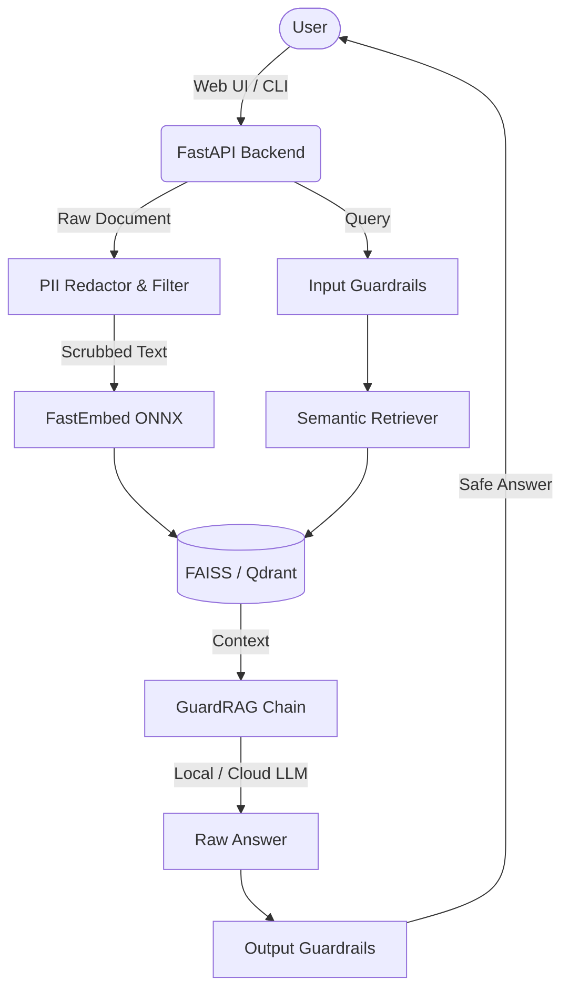

<div align="center">

# 🛡️ GuardRAG Enterprise

### Privacy-First, Fully Offline AI Document Intelligence
**Secured by a 4-Tier Safety Guardrails Engine**

[](https://pypi.org/project/guard-rag/)


<br/>

> **Empower your organization to interact with sensitive documents securely.**  
> GuardRAG runs entirely on your local infrastructure. No data leaves your network, and every AI response is strictly grounded and cited.  
> Protected by enterprise-grade data redaction, credential blocking, and anti-jailbreak safeguards.

</div>

---

## 🌟 Executive Summary

GuardRAG is engineered for professionals and organizations handling confidential data—Legal, Healthcare, Finance, and Enterprise IT. It provides a highly secure Retrieval-Augmented Generation (RAG) pipeline that lets you query internal documents without exposing sensitive information to public APIs or unauthorized internal LLM prompts.

| **Capability** | **Description** |
| :--- | :--- |
| 🛡️ **Offline Security** | Operates 100% offline using local Ollama LLMs and ONNX-accelerated vector embeddings. |
| 🔐 **Data Redaction** | Context-aware PII scrubbing automatically redacts SSNs, emails, and names prior to indexing. |
| 📊 **Verifiable Citations** | The AI never hallucinates its sources. Every answer includes verifiable document citations. |
| 🌐 **Modern Web Console** | Intuitive, responsive web UI for managing vector libraries, adjusting LLM models, and interacting with data. |
| 🔌 **Cloud Extensibility** | Drop-in support for OpenAI, Anthropic, Cohere, Groq, and OpenRouter for hybrid deployments. |

---

## 🏗️ Enterprise Architecture

GuardRAG’s architecture is built on a strict boundary between document processing and LLM interaction, ensuring that sensitive data is filtered before it reaches the language model.



---

## 🛡️ 4-Tier Safety Guardrails

Configure your security baseline on a per-session basis. The guardrail engine runs locally and does not depend on external moderation APIs.

| Tier | Icon | Protection Level |
| :--- | :---: | :--- |
| **Public** | 🟢 | Base protection against prompt injections, jailbreaks, and DAN-mode attacks. |
| **Internal** | 🔵 | *Public* + Blocks exposure of API keys, bearer tokens, passwords, and server credentials. |
| **Confidential** | 🟡 | *Internal* + Scrubs SSNs, emails, phone numbers, and credit card numbers. |
| **Restricted** | 🔴 | *Confidential* + Certified lock for Medical/Financial data, diagnoses, and salary info. |

---

## 📥 Installation

Install the production-ready package directly from PyPI.

```bash
pip install guard-rag
```

**System Requirements:**
1. **Python 3.9+**
2. **Ollama**: Required for offline LLM support. Download from [ollama.com](https://ollama.com).
3. **Windows Users**: Must install the [Microsoft Visual C++ Redistributable](https://aka.ms/vs/17/release/vc_redist.x64.exe).

---

## 🚀 Quick Start

### 1. Web Console (Recommended)

Launch the integrated Web UI. GuardRAG will automatically start a local server and open your default browser.

```bash
guard-rag
```

*The web console supports LAN sharing. Just navigate to the `ACCESS (LAN)` URL displayed in your terminal from any device on your network.*

### 2. Command Line Interface (CLI)

For headless server environments or automated pipelines, use the CLI directly:

```bash
# Query a confidential contract using a local LLaMA model
guard-rag --pdf path/to/contract.pdf --model llama3.1 --sensitivity Confidential
```

**CLI Configuration Flags:**

| Flag | Description | Default |
| :--- | :--- | :--- |
| `--pdf <file>` | Path to the target document (PDF, TXT, DOCX) | **Required** |
| `--model <name>` | LLM name (e.g., `gemma3:1b`, `llama3.1`) | `gemma3:1b` |
| `--ollama-host <url>` | LLM Endpoint (Local or Cloud API) | `http://localhost:11434` |
| `--sensitivity <lvl>`| Set guardrail tier (`Public`, `Internal`, `Confidential`, `Restricted`) | `Internal` |
| `--chunk-size <int>` | Text segment token limit | `1000` |

---

## 🐍 Python SDK Integration

GuardRAG can be integrated seamlessly into your existing Python pipelines.

```python
from guardrag import build_rag_chain, load_stored_rag_chain
from guardrag.utils.safety import check_input_safety

# 1. Initialize an offline RAG pipeline with PII Redaction
db_id, chain = build_rag_chain(
    file_paths=["financial_q3.pdf"],
    model="llama3.1",
    sensitivity="Restricted",
    redact_pii=True,
)

# 2. Query the Knowledge Base safely
response = chain.invoke({
    "input": "Summarize the Q3 earnings.",
    "chat_history": []
})

print(response["answer"])

# 3. Access Citations
for citation in response.get("context", []):
    print(f"Cited Source: {citation.metadata['source']}")
```

---

## 🤝 Support & Enterprise Licensing

GuardRAG is an open-source project under the MIT License. 
For enterprise deployment assistance, custom cloud integrations, or feature requests, please open an issue or reach out to the maintainers.

<div align="center">

Built with ❤️ by **[Sowmiyan S](https://github.com/sowmiyan-s)**

[GitHub Repository](https://github.com/sowmiyan-s/GUARD-RAG) · [Issue Tracker](https://github.com/sowmiyan-s/GUARD-RAG/issues)

</div>
